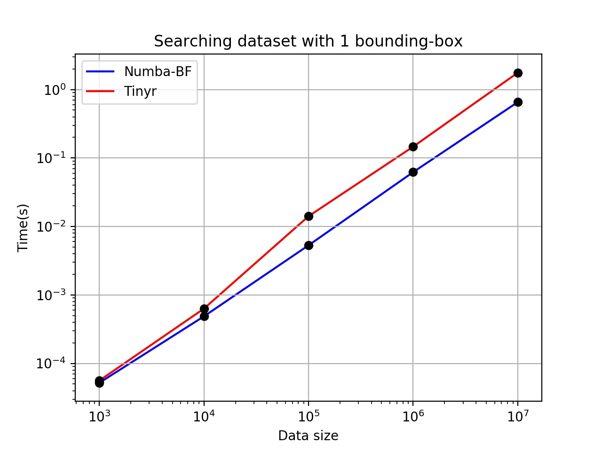

[py-rbush]: https://github.com/parietal-io/py-rbush
[GDAL]: http://www.gdal.org/
[GEOS]: https://trac.osgeo.org/geos
[JavaScript rbush]: https://github.com/mourner/rbush
[Numba]: http://numba.pydata.org/
[Cython]: http://cython.org/
[R-tree]: https://en.wikipedia.org/wiki/R-tree
[mem-limit]: https://github.com/numba/numba/issues/2560
[Cython]: http://cython.org/
[Tinyr]: https://code.google.com/archive/p/tinyr/

# RBush for Python

The mission of the [py-rbush] is to provide a performant, thread-safe RTree
implementation for Python which does not have [GDAL]/[GEOS] as a dependencies.

The goal is to make a port of [JavaScript rbush] library to Python and boost
the Python performance using [Numba].
During the development of this implementation some limitations of Numba were
blocking the performance gain which we tried to work around with [Cython].

Here it is described the main points this development passed through.


## Using Numba

[Numba] is an abstraction interface to C *just in time* (JIT) compiler for
Python.
It provides out-of-the-box support for Numpy arrays, loop vectorization and
parallelism.
As of this writing, Numba is in its verison `0.36`.

Numba is a syntax-clean set of rules to decorate Python functions
and classes while keeping the code (pure) Python compatible.
It provides fast Numpy arrays processing by keeping indexing and
computation between arrays at the C level.
It also vectorizes `for`/`while` loops, boosting significantly nested operations.
Those two features were seen as critical for performance in such iteractive algorithms
as the ones found in an [R-tree] building/searching procedures.

To guide the optimization process a brute-force search test was implemented using
Numba.
In this test, a `numba.jit` function loops over a 700K length numpy array containing
the bounding-boxes defining the `RBush` contents.
Although a tree data structure is not primarily about the absolute time spent in
building/searching the tree content -- but about how time scales (~log(N)) as the
volume of data increases -- such test is thought to provide a good landmark for
comparison.
Compared to such test case, performance improvements should at least approximate
(~same order of magnitude) the amount of time on searching for matching items.

For instance, Numba's brute-force test:
```python
@nb.njit
def search_brute_force(data, boxes, xmin, ymin, xmax, ymax):
    """
    * data:
      (N,1) numpy array
    * boxes:
      (N,4) numpy array
    * xmin,ymin,xmax,ymax:
      bounding-box
    """
    final_result = []
    for i in range(len(boxes)):
        rxmin = boxes[i][0]
        rymin = boxes[i][1]
        rxmax = boxes[i][2]
        rymax = boxes[i][3]

        # intersects
        if (rxmin <= xmax and rymin <= ymax) and (rxmax >= xmin and rymax >= ymin):
            final_result.append(data[i])

    return final_result
```

While implementing Numba in RBush, though, some limitations were found to
block the high-performance goal of the library:
* the use of `jitclass` on defining the tree nodes has not improved RBush's
performance;
* `jitclass`es do not allow pure Python objects --for instance, `list`-- to
be used as class members, which forced us to implement a *stack* class to
handle nodes' children.
* the use of nested data containers (*e.g*, lists) has [limitations][mem-limit],
in particular for variable length items.

The inability to handle nested (memory-managed) object containers was a showstopper
for RBush development as one of R-tree's characteristics is to have variable
length nodes, with numbers varying from "`min-entries`" to "`max-entries`", set at
tree's initialization stage.


We tried to workaround the variable length nested `array/tuple` structure by
implementing `Node` and `LinkedList` (`jitclass`) classes.
Such implementation succeed from the memory management point-of-view, but
failed in speeding up the computations, bringing us to believe that Numba classes
do not profit from low-level optimizations.


## Using Cython

[Cython] is a static compiler for Python.
In practice, Cython adds special keywords and syntax to Python code to allow
low-level, C code generation; typing variables being the first level of optimization
to pure Python code.
The main drawback of Cython is break with pure Python syntax: once Cython syntax
is added to Python code, portability is diminished, requiring users to go through
a setup process where C-code compilation is necessary.

To approach the problem we took [Tinyr] as example.
Tinyr implements a (2D) R-tree entirely using Cython.

The first step taken was to compare Tinyr with our Numba brute-force test.
Running Tinyr against Numba's brute-force test, using the pre-set default tree
size of 100K boxes, Tinyr performed three searches in $0.014\ seconds$, while
Numba's brute-force search consumed $0.004\ seconds$.
The figure @fig:tinyr_bruteforce presents the average time consumed for searching
trees/datasets of different sizes.

<!-- Values and plot definition for the figure below:

num = [1000, 10000, 100000, 1000000, 10000000]
bf = [5.20e-05, 0.000486, 0.005302, 0.062148, 0.65496]
tr = [5.60e-05, 0.00063, 0.0141, 0.14628, 1.76068]

fig,ax = plt.subplots()
pbf, = ax.loglog(num, bf, color='blue', label='Numba-BF', zorder=1)
ptr, = ax.loglog(num, tr, color='red', label='Tinyr', zorder=1)
ax.scatter(num, bf, color='black', zorder=2)
ax.scatter(num, tr, color='black', zorder=2)
ax.legend(handles=[pbf,ptr])
ax.set_xlabel('Data size')
ax.set_ylabel('Time(s)')
ax.set_title('Searching dataset with 1 bounding-box')
ax.grid(True)
plt.show()

-->
{#fig:tinyr_bruteforce width=250px}

Besides slower, Tinyr scales linear with the size of the problem, which is a
behaviour not expected from a (R)tree algorithm.
Further analysis needs to be done to understand if Tinyr's algorithm alone
is faulty in what regards a logarithm-ish scaling or whether Cython is also
contributing to such performance.

## Conclusion

This is a working in progress and every insight, suggestion is much welcome.

We have handled non-trivial (custom) data structures in Numba and knocked against
limitations in the library in handling nested containers, as well as poor
performance when using Numba *jitclasses*.
On the other hand, Cython -- as seen through Tinyr -- also performs poorly
compared to a linear brute-force of Numba; even worse, the R-tree implementation
in Tinyr scales linearly with the size of the dataset stored.

Clearly Numba performs pretty well when handling numpy arrays, and its implementation
in a Python code is clean, made for simplicity.
But it is not clear yet how to handle non-trivial (or custom) data structures.
